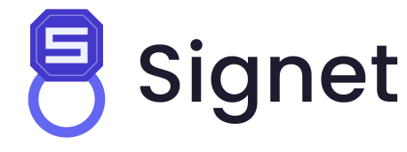
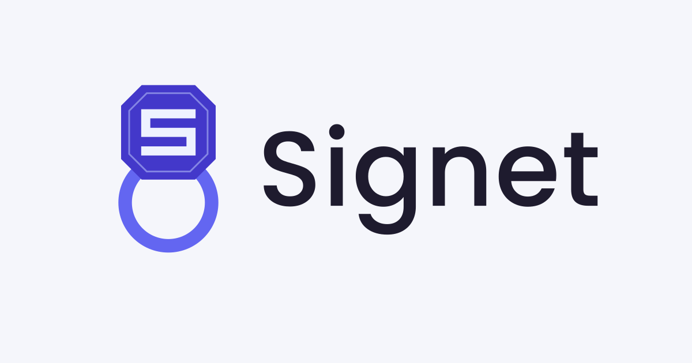
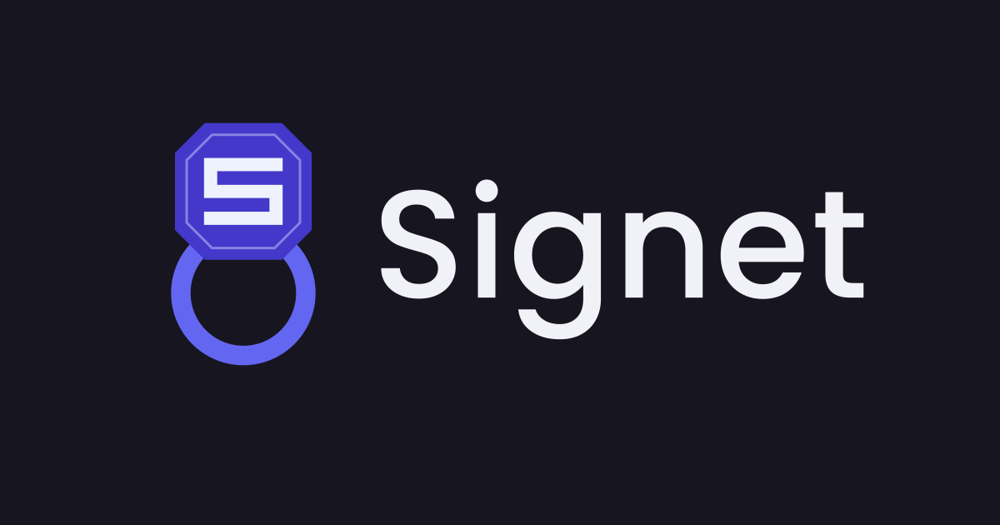

# Signet brand assets

<p align="center">
  <picture>
    <source media="(prefers-color-scheme: dark)" srcset="logo-dark.svg">
    
  </picture>
</p>

Official brand assets for [Signet](https://github.com/go-signet) — a self-hosted OAuth 2.0 / OIDC authorization server written in Go.

The identity is a **signet ring** — the original instrument for signing and certifying documents, which is exactly what Signet does for your tokens. The system uses two marks that share one geometry:

|                                                              Full mark — `mark.svg`                                                               |                                                         Small mark — `icon.svg`                                                         |
| :-----------------------------------------------------------------------------------------------------------------------------------------------: | :-------------------------------------------------------------------------------------------------------------------------------------: |
|                                                                                      |                                                                       |
| The complete ring — octagonal bezel with a carved "S" on a ring band. Use wherever there is room: README headers, websites, slides, social cards. | The bezel alone. Use at small sizes: favicons, org avatar, app icons, 16–64 px contexts where the band would collapse into a thin line. |

The small mark stays legible all the way down:

<p>
  &nbsp;&nbsp;
  &nbsp;&nbsp;
  &nbsp;&nbsp;
  &nbsp;&nbsp;
  
</p>

## Why the ring

- **The ring is the key; the impression is the signature.** A signet ring stays with its owner — pressing it into wax produces a mark anyone can verify but nobody else can make. That is exactly Signet's job: the ring is the private key you hold, the impression is the verifiable signature (RS256) it stamps onto every token. The logo _is_ the architecture diagram.
- **Two marks, one bezel.** The full mark and the small mark share the same octagonal bezel — same geometry, same colors. When the logo scales down and the band is dropped, what remains is still unmistakably the same object, so brand recognition never breaks between a conference slide and a 16 px favicon.
- **Two indigo steps make the depth.** The bezel sits in front in `#4338CA`; the band recedes one step lighter in `#6366F1`. Two flat tones are enough to read as a three-dimensional ring — no gradients or shadows needed, which also keeps the mark trivially reproducible.
- **An octagon, not a circle.** The eight-sided bezel reads as a cut, engraved stone, and its silhouette stays distinctive at tiny sizes where a circle would blend into every other round avatar.
- **The "S" is carved, not printed.** The frost (`#EEF2FF`) strokes are drawn as engraved lines in the stone — a seal ready to stamp, not a letter pasted on top.

## Files

| File                               | Usage                                                                     |
| ---------------------------------- | ------------------------------------------------------------------------- |
| `logo.svg`                         | Full lockup (ring + wordmark) for light backgrounds                       |
| `logo-dark.svg`                    | Full lockup for dark backgrounds                                          |
| `logo-auto.svg`                    | Lockup that follows `prefers-color-scheme` (websites; not GitHub READMEs) |
| `mark.svg`                         | Full mark, square — slides, stickers, large avatars                       |
| `icon.svg`                         | Small mark, square — favicons and tiny contexts                           |
| `preview.png` / `preview-dark.png` | 1200×630 social / Open Graph cards                                        |
| `favicon/`                         | Generated favicon set (from the small mark) + `HEAD-snippet.html`         |

The wordmark is set in [Poppins](https://fonts.google.com/specimen/Poppins) (Medium 500), converted to outlines — no font dependency.

|                        `preview.png`                         |                        `preview-dark.png`                        |
| :----------------------------------------------------------: | :--------------------------------------------------------------: |
|  |  |

## Palette

| Name         | Hex       | Usage                             |
| ------------ | --------- | --------------------------------- |
| Bezel indigo | `#4338CA` | Bezel fill, primary brand color   |
| Band indigo  | `#6366F1` | Ring band                         |
| Frost        | `#EEF2FF` | Carved "S" strokes                |
| Periwinkle   | `#C7D2FE` | Hairline inner frame              |
| Ink          | `#1E1B2E` | Wordmark on light backgrounds     |
| Cream        | `#F1F2F8` | Wordmark on dark backgrounds      |
| Paper        | `#F5F6FB` | Light background / preview canvas |

## Light & dark mode

The marks are mode-agnostic — only the wordmark ink switches.

GitHub README snippet:

```html
<picture>
  <source
    media="(prefers-color-scheme: dark)"
    srcset="
      https://raw.githubusercontent.com/go-signet/brand/main/logo-dark.svg
    "
  />
  
</picture>
```

`logo-auto.svg` works when embedded on websites, but GitHub strips `<style>` from SVGs in READMEs — use the `<picture>` pattern there.

## Usage rules

- Full mark above ~64 px height; small mark below.
- Keep clear space of at least 25% of the mark's width.
- Do not recolor, add gradients or shadows, rotate the octagon, or detach the bezel from the band in the full mark.
- GitHub org avatar: `favicon/android-chrome-512x512.png` (GitHub does not accept SVG).

## License

Brand assets are released under CC BY 4.0. "Signet" and the ring mark identify the go-signet project — please don't use them to imply endorsement.
